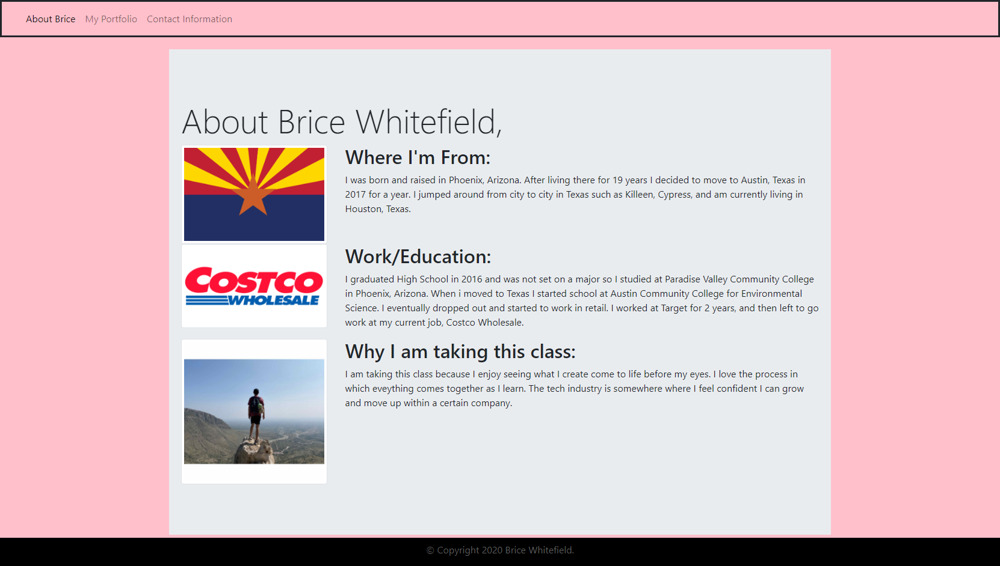

# Homework 2
# Brice Whitefield's Portfolio
* In this homework assignment I made a webpage from scratch using my knowledge of HTML,CSS, as well as CSSBoostrap.
    
    # Link to the website:
    [Deployed-Website](https://swagmaster678.github.io/Brice-White-Field-Portfolio/)
    
    # Link to my repository:
    [My Repository](https://github.com/swagmaster678/Brice-White-Field-Portfolio)

    # Screenshot of the working web page:
    

 
-About Me 
* Has a navbar that has linkts to About me, Portfolio page, and Contact information.
* Has a responsive layout.
* Has responsive images.
* Functional.
* Properly uses Bootstrap.
* Contains personalized information such as bio, name, and images.
* Uses semantic HTML.

-My Portfolio 
* Has a navbar that has linkts to About me, Portfolio page, and Contact         information.
* Has a responsive layout.
* Has responsive images.
* Functional.
* Properly uses Bootstrap.
* Contains personalized information such as images.
* Uses semantic HTML.

-My Contact Information
* Has a navbar that has linkts to About me, Portfolio page, and Contact information.
* Has a responsive layout.
* Has responsive images.
* Functional.
* Properly uses Bootstrap.
* Contains personalized information such as contact information and social media.
* Uses semantic HTML.

